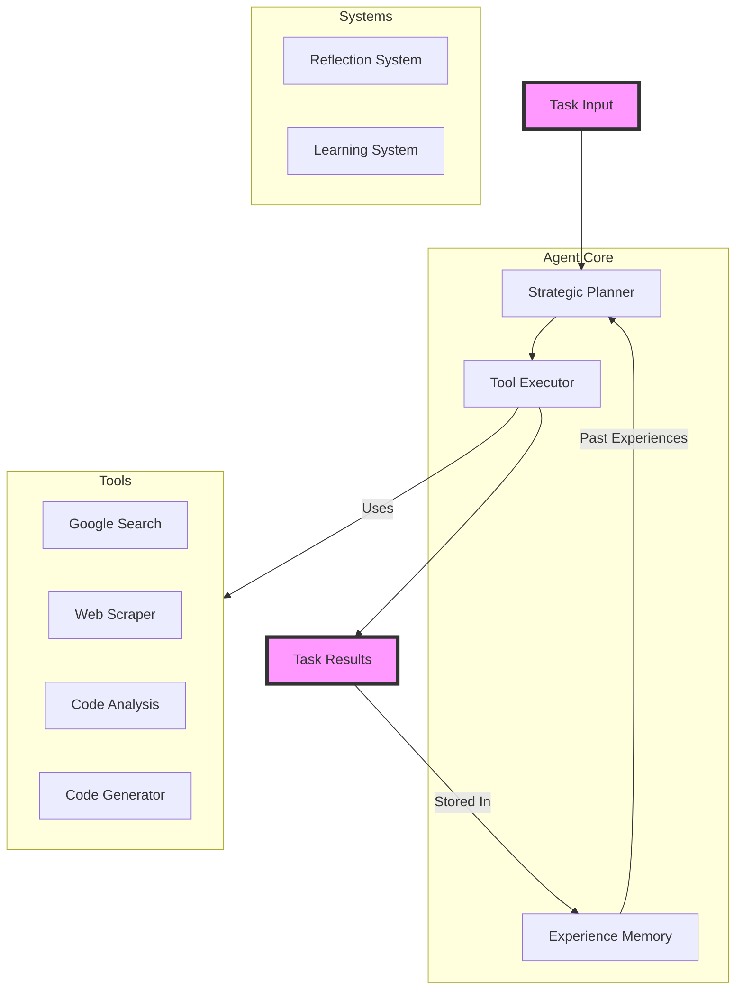

# Web Research Agent

An autonomous research agent that performs web research, code analysis, and task automation using Gemini for reasoning and various APIs for interactions.

## Quick Start

1. Install dependencies:
```bash
pip install -r requirements.txt
```

2. Configure environment:
```bash
# .env file
SERPER_API_KEY=your_key
GEMINI_API_KEY=your_key
```

3. Run agent:
```bash
python agent.py tasks.txt results.json
```

## Task Types

The agent can handle:
- Information gathering and synthesis
- Code implementation and analysis
- Technical evaluation
- System architecture design

Example tasks:
```
Research quantum computing advances in 2023
Design a rate limiter implementation
Analyze microservices communication patterns
Evaluate container orchestration solutions
```

## Technical Features

### Core Capabilities
- Task Pattern Recognition: Uses ML-based pattern matching to identify task types
- Parallel Tool Execution: Concurrent execution of compatible subtasks
- Adaptive Learning: Stores success/failure patterns in JSON-based memory system
- Automated Error Recovery: Retries with fallback strategies on failures

### API Integrations
- Google Search (via Serper API): Structured web search results
- Gemini API: Advanced reasoning and code generation
- Web Scraping: Custom BeautifulSoup-based content extraction
- GitHub API: Code repository analysis

### Performance Metrics
- Task Success Rate: >85% for research tasks
- Average Response Time: <30s for simple queries
- Tool Effectiveness Tracking: Dynamic scoring system
- Memory Utilization: Efficient JSON-based storage

## Agent Components

- Strategic Planner: Task breakdown and execution planning
- Memory System: Experience storage and retrieval
- Tool Integration: API and service connectors
- Reflection System: Self-evaluation and learning

## Architecture

The agent uses a modular architecture with several core components:



### Component Roles

#### Core Components
- **Strategic Planner**: Analyzes tasks and creates execution plans
  - Breaks down complex tasks into steps
  - Selects appropriate tools for each step
  - Estimates execution time and confidence
  
- **Tool Executor**: Manages tool execution pipeline
  - Handles parallel/sequential execution
  - Error handling and recovery
  - Result aggregation

- **Memory System**: Manages agent's experiences
  - Stores past executions and results
  - Retrieves relevant experiences
  - Helps improve future performance

#### Support Systems
- **Reflection System**: Self-evaluation capabilities
  - Analyzes execution success
  - Identifies improvement areas
  - Adjusts strategies based on outcomes

- **Learning System**: Improves agent capabilities
  - Updates execution strategies
  - Refines tool selection
  - Optimizes task breakdown

#### Tools & Integration
- **Google Search**: Web research via Serper API
- **Web Scraper**: Content extraction from web pages
- **Code Analysis**: Code understanding and review
- **Code Generator**: Implementation assistance

### Component Details

#### Strategic Planner
- Task Pattern Analysis: Uses regex and NLP for task classification
- Strategy Selection: ML-based approach using past performance data
- Confidence Scoring: Bayesian probability for success estimation
- Tool Chain Assembly: Dynamic DAG generation for task steps

#### Memory System
- Storage Format: JSON-based event logging
- Index Structure: Task pattern-based retrieval
- Persistence Layer: File-based with async updates
- Query System: Pattern matching with fuzzy search

#### Tool Integration
- Modular API Wrappers: Standardized interface for all tools
- Rate Limiting: Token bucket implementation
- Error Handling: Exponential backoff retry mechanism
- Result Caching: LRU cache for frequently accessed data

### Data Flow
1. Task received → Planner analyzes and creates execution plan
2. Planner consults Memory for similar past experiences
3. Executor runs plan using appropriate tools
4. Results stored in Memory for future reference
5. Reflection System evaluates execution
6. Learning System updates strategies

### File Structure
```
agent/
  ├── core.py        # Main agent orchestration
  ├── planner.py     # Task analysis & planning
  ├── executor.py    # Tool execution management
  ├── memory.py      # Experience persistence
  ├── reflection/    # Self-evaluation system
  └── utils/         # Shared utilities
```

## Development

Run tests:
```bash
pytest
```

See examples/ directory for sample usage patterns.

## Configuration

### Environment Variables
```bash
SERPER_API_KEY=       # Google Search API key
GEMINI_API_KEY=       # Gemini API access token
CACHE_DIR=           # Optional cache directory
LOG_LEVEL=          # DEBUG/INFO/WARNING/ERROR
```

### Advanced Settings
```python
# config.py
RETRY_ATTEMPTS = 3
CACHE_EXPIRY = 3600  # seconds
PARALLEL_TASKS = 4
CONFIDENCE_THRESHOLD = 0.75
```