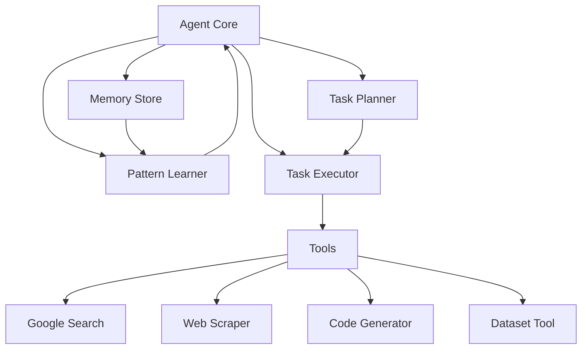

# Web Research Agent

An intelligent agent system that performs web research, code generation, and data analysis tasks using a combination of LLM, pattern learning, and automated planning.

## Architecture



## Project Structure

```
web_research_agent/
├── agent/                  # Core agent components
│   ├── __init__.py
│   ├── core.py            # Main agent implementation
│   └── executor.py        # Task execution handling
├── tools/                 # Tool implementations
│   ├── __init__.py
│   ├── base.py           # Base tool class
│   ├── google_search.py
│   ├── web_scraper.py
│   ├── code_tools.py
│   └── dataset_tool.py
├── memory/               # Memory management
│   ├── __init__.py
│   └── memory_store.py
├── planning/            # Task planning
│   ├── __init__.py
│   └── task_planner.py
├── learning/           # Pattern learning
│   ├── __init__.py
│   └── pattern_learner.py
├── utils/             # Utilities
│   ├── __init__.py
│   ├── logger.py
│   └── prompts.py
├── formatters/        # Output formatting
│   ├── __init__.py
│   └── pretty_output.py
├── tests/            # Test suite
│   ├── __init__.py
│   └── test_*.py
└── agent.py         # Main entry point
```

## Features

- **Task Planning**: Sophisticated task decomposition and planning
- **Pattern Learning**: Learns from previous executions to improve performance
- **Memory Management**: SQLite-based persistent memory store
- **Parallel Execution**: Handles multiple tasks and subtasks concurrently
- **Tool Integration**: Modular tool system for extensibility
- **Error Recovery**: Robust error handling and retry mechanisms

## Requirements

```plaintext
Python 3.8+
Required packages in requirements.txt
```

## Installation

1. Clone the repository:
```bash
git clone https://github.com/ashioyajotham/web_research_agent.git
cd web_research_agent
```

2. Create and activate virtual environment:
```bash
python -m venv venv
source venv/bin/activate  # On Windows: venv\Scripts\activate
```

3. Install dependencies:
```bash
pip install -r requirements.txt
```

4. Set up environment variables:
```bash
cp .env.example .env
# Edit .env with your API keys
```

## Usage

1. Create a task file (e.g., `tasks.txt`):
```text
research the latest developments in quantum computing
implement a binary search tree in Python
analyze climate change data from the past decade
```

2. Run the agent:
```bash
python agent.py tasks.txt output.json
```

## Configuration

Key configuration options in `AgentConfig`:

```python
config = AgentConfig(
    max_steps=10,          # Maximum execution steps
    min_confidence=0.7,    # Minimum confidence threshold
    timeout=300,           # Execution timeout in seconds
    memory_path="agent_memory.db",  # Memory storage path
    parallel_execution=True,        # Enable parallel execution
    planning_enabled=True,          # Enable task planning
    pattern_learning_enabled=True   # Enable pattern learning
)
```

## Adding New Tools

1. Create a new tool class inheriting from `BaseTool`:
```python
from tools.base import BaseTool

class MyNewTool(BaseTool):
    async def execute(self, **params):
        # Implement tool logic
        pass
```

2. Register the tool in the agent initialization:
```python
tools = {
    "my_new_tool": MyNewTool(),
    # ...other tools...
}
```

## Contributing

1. Fork the repository
2. Create a feature branch (`git checkout -b feature/improvement`)
3. Commit changes (`git commit -am 'Add improvement'`)
4. Push to branch (`git push origin feature/improvement`)
5. Open a Pull Request

## License

MIT License - See LICENSE file for details