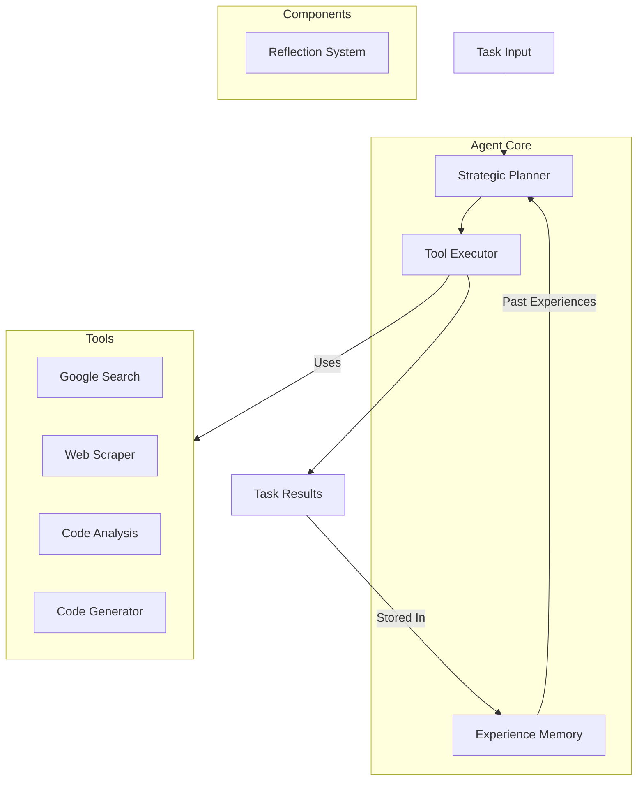

# Web Research Agent

An autonomous research agent that performs web research, code analysis, and task automation using Gemini for reasoning and various APIs for interactions.

## Quick Start

1. Install dependencies:
```bash
pip install -r requirements.txt
```

2. Configure environment:
```bash
# .env file
SERPER_API_KEY=your_key
GEMINI_API_KEY=your_key
```

3. Run agent:
```bash
python agent.py tasks.txt results.json
```

## Task Types

The agent can handle:
- Information gathering and synthesis
- Code implementation and analysis
- Technical evaluation
- System architecture design

Example tasks:
```
Research quantum computing advances in 2023
Design a rate limiter implementation
Analyze microservices communication patterns
Evaluate container orchestration solutions
```

## Agent Components

- Strategic Planner: Task breakdown and execution planning
- Memory System: Experience storage and retrieval
- Tool Integration: API and service connectors
- Reflection System: Self-evaluation and learning

Add new capabilities by:
1. Creating a tool class in tools/ that extends BaseTool
2. Implementing execute() and get_description()
3. Registering in agent.py

## Architecture

The agent uses a modular architecture with several core components:



```
agent/
  ├── core.py        # Agent core logic
  ├── planner.py     # Strategic planning
  ├── executor.py    # Tool execution
  ├── memory.py      # Experience system
  └── utils/         # Shared utilities
tools/               # Tool implementations
examples/            # Usage examples
```

## Development

Run tests:
```bash
pytest
```

See examples/ directory for sample usage patterns.