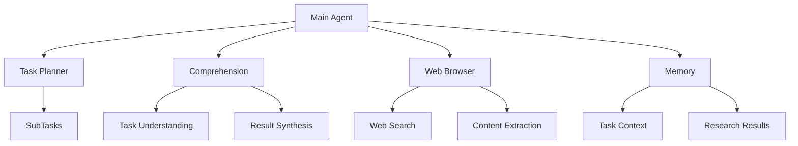

# Web Research Agent

## Overview
An AI-powered web research agent that can process complex research tasks, search the web for information, and synthesize findings into comprehensive reports. Built with Google's Gemini Pro, it handles multi-criteria tasks, data analysis, and temporal research queries.

## Architecture


## Features
- **Dynamic Task Understanding**: Automatically recognizes and adapts to different task types
- **Intelligent Web Search**: Uses advanced search techniques with proper source validation
- **Multi-criteria Analysis**: Handles complex tasks with multiple requirements
- **Rich Output Formatting**: Clean, formatted output with progress tracking
- **Source Validation**: Tracks and validates information sources
- **Memory Management**: Maintains context across related tasks

## Project Structure
```
web_research_agent/
├── agent/
│   ├── __init__.py
│   ├── browser.py      # Web search and content extraction
│   ├── comprehension.py # Task understanding and synthesis
│   └── planner.py      # Task planning and execution
├── models/
│   ├── __init__.py
│   └── llm.py         # LLM interface and implementations
├── utils/
│   ├── __init__.py
│   ├── helpers.py     # Shared utilities
│   └── timer.py       # Performance tracking
├── logs/              # Timestamped execution logs
├── results/           # Research results output
├── main.py           # Entry point
└── requirements.txt
```

## Installation
1. Clone the repository:
```bash
git clone https://github.com/ashioyajotham/web_research_agent.git
cd web_research_agent
```

2. Create and activate a virtual environment:
```bash
python -m venv venv
.\venv\Scripts\activate  # Windows
```

3. Install dependencies:
```bash
pip install -r requirements.txt
```

4. Set up API keys:
   - Create a .env file in the root directory
   - Add your API keys:
     ```
     GEMINI_API_KEY=your_gemini_api_key
     SERPER_API_KEY=your_serper_api_key
     ```

## Usage
Run the agent with a task file:
```bash
python main.py tasks.txt
```

### Task File Format
```
Task 1 description
---
Task 2 description
---
Multi-line task description
with criteria:
- Criterion 1
- Criterion 2
```

### Verbose Mode
For detailed output:
```bash
python main.py tasks.txt --verbose
```

## Output
- Results are saved to results.txt
- Detailed logs are saved to `logs/run_YYYYMMDD_HHMMSS.log`
- Console shows progress with rich formatting

## Development
- Python 3.8+
- Uses Google's Gemini Pro for LLM capabilities
- Async operations for efficient web requests
- Rich terminal output with progress tracking

## Contributing
1. Fork the repository
2. Create your feature branch (`git checkout -b feature/amazing-feature`)
3. Commit your changes (`git commit -m 'Add amazing feature'`)
4. Push to the branch (`git push origin feature/amazing-feature`)
5. Open a Pull Request

## License
MIT License - see LICENSE file for details
```