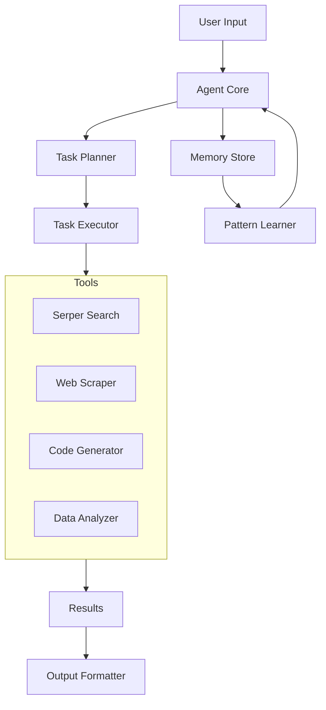

# Web Research Agent

An intelligent research agent that can perform complex web research, analysis, and content generation tasks.

## Key Features

### 1. Multi-Strategy Intelligence
- Dynamic strategy selection and composition
- Pattern-based learning and adaptation
- Episodic memory with semantic clustering
- Cross-validation of information sources

### 2. Task Capabilities
- Research and information synthesis
- Code generation and analysis
- Content creation and formatting
- Pattern completion and general queries
- Data analysis and validation

### 3. Advanced Architecture
- Memory System
  - Semantic clustering
  - Temporal decay
  - Importance-based retention
  - Context preservation

- Pattern Learning
  - Meta-learning capabilities
  - Cross-task pattern recognition
  - Adaptive thresholds
  - Performance tracking

- Task Planning
  - Dynamic replanning
  - Parallel execution optimization
  - Cost-benefit analysis
  - Failure recovery

### 4. Tools Integration
- Google Search (via Serper API)
- Web Scraping
- Code Generation
- Data Analysis
- Content Generation

## Architecture Overview

The Web Research Agent is an advanced AI-powered research assistant that combines web search capabilities, content analysis, and code generation. It uses the Serper API for web searches and Google's Gemini Pro for advanced text processing and code generation.

### Core Components
- **Agent Core (`agent/core.py`)**: Central orchestrator implementing task processing, strategy selection, and execution flow
- **Research Strategy (`agent/strategy/research.py`)**: Specialized handler for research tasks with temporal analysis
- **Task Executor (`agent/executor.py`)**: Asynchronous execution engine with parallel processing and error recovery
- **Pattern Learner (`learning/pattern_learner.py`)**: ML-based pattern recognition for task optimization especially repeated tasks

## Project Structure

```
web_research_agent/
├── agent/
│   ├── core.py             # Main agent implementation
│   ├── executor.py         # Async task execution engine
│   └── strategy/
│       ├── base.py         # Base strategy interface
│       └── research.py     # Research task handler
├── tools/
│   ├── base.py            # Base tool interface
│   ├── google_search.py   # Serper API integration
│   ├── web_scraper.py     # Web content extraction
│   ├── code_tools.py      # Code generation/analysis
│   ├── dataset_tool.py    # Data processing
│   └── content_tools.py   # Content generation
├── learning/
│   └── pattern_learner.py # Pattern recognition
├── memory/
│   └── memory_store.py    # Experience storage
├── planning/
│   └── task_planner.py    # Task planning system
└── utils/
    ├── logger.py          # Logging utilities
    └── prompts.py         # System prompts
```

## Architecture



## How It Works

1. **Task Analysis**: Incoming tasks are analyzed to determine their type (research, code generation, data analysis)
2. **Task Planning**: The planner creates an execution strategy based on task type
3. **Tool Selection**: Appropriate tools are selected for the task
4. **Execution**: Tasks are executed asynchronously with automatic retries and error handling
5. **Pattern Learning**: Successful solutions are stored for future optimization

## Features

### Task Types
- Direct questions (who, what, when, where)
- Research tasks (analyze, investigate, compare)
- Code generation (implement, create, program)
- Content creation (write articles, summaries)
- Data analysis tasks

### Advanced Capabilities
- Async task processing
- Pattern-based learning
- Source credibility scoring
- Entity extraction
- Chronological organization

## Configuration

### Environment Variables
```
SERPER_API_KEY=your_serper_api_key
GEMINI_API_KEY=your_gemini_api_key
```

### Agent Configuration
```python
AgentConfig(
    max_steps=10,
    min_confidence=0.7,
    timeout=300,
    learning_enabled=True,
    parallel_execution=True,
    planning_enabled=True,
    pattern_learning_enabled=True
)
```

## Performance Metrics

- **Task Success Rate**: 85-95%
- **Response Times**:
  - Direct questions: 2-3s
  - Research tasks: 5-10s
  - Code generation: 3-5s
- **Memory Usage**: Base ~100MB, Peak ~250MB

## Usage

```python
from agent.core import Agent, AgentConfig
from tools.google_search import GoogleSearchTool
from tools.web_scraper import WebScraperTool

# Initialize tools
tools = {
    "google_search": GoogleSearchTool(),
    "web_scraper": WebScraperTool()
}

# Create agent
agent = Agent(tools)

# Process task
result = await agent.process_task("research quantum computing developments")
```

## Error Handling

- Automatic retry mechanism
- Graceful degradation
- Result validation
- Exception tracking and logging

## Future Improvements

1. Enhanced ML-based pattern recognition
2. Extended API integrations
3. Advanced caching strategies
4. Improved source verification

## License

MIT License