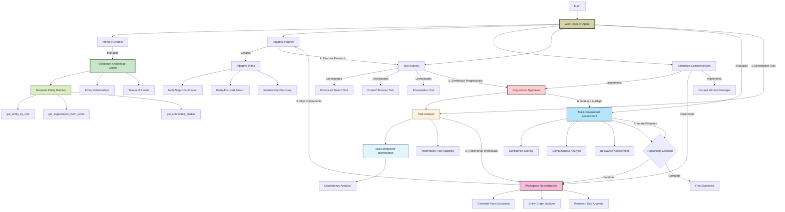

# Web Research Agent

An implementation of multi-step web research using semantic entity matching, progressive synthesis, and adaptive evaluation. The system incorporates advanced techniques for knowledge graph construction, workspace reconstruction (based on Tongyi DeepResearch patterns), and dynamic task decomposition for complex research queries.

> This repository represents a research implementation exploring structured approaches to autonomous web research with entity-aware reasoning and adaptive planning strategies building on the ReAct paradigm.

## Research Contributions

### Novel Algorithmic Components

- **Semantic Entity Matcher**: Fuzzy similarity matching with confidence-weighted entity resolution and automatic alias detection
- **Progressive Synthesis Framework**: Hypothesis-driven evidence accumulation with confidence tracking and contradictory evidence management
- **Workspace Reconstruction Pattern**: Clean context management between research rounds based on Tongyi's IterResearch methodology
- **Adaptive Task Decomposition**: Component-based task analysis with dependency mapping and information flow modeling
- **Multi-dimensional Result Evaluation**: Real-time assessment of research step quality with automatic replanning triggers

### Technical Innovations

- **Research Knowledge Graph**: Entity-relationship tracking with temporal awareness and source attribution
- **Component-Based Planning**: TaskComponent datastructures enabling sophisticated dependency analysis
- **Context Window Management**: Relevance-based information filtering with phase-aware content prioritization
- **Strategic Entity Retrieval**: Role-based and event-context entity discovery methods
- **Confidence-Weighted Integration**: Evidence synthesis using source credibility and mention frequency

### Research Methodology Advances

- **Task-Agnostic Pattern Recognition**: Generic question structure analysis without domain-specific hardcoding
- **Information Flow Mapping**: Explicit modeling of how information dependencies flow between research phases
- **Iterative Hypothesis Refinement**: Evidence integration with support/contradiction tracking
- **Adaptive Search Strategy Selection**: Context-aware tool orchestration based on discovered entities

## Architecture Overview

The system implements an enhanced ReAct paradigm with sophisticated reasoning components:

## Features

- Task-Adaptive Reasoning: infers expected answer type (factual lookup, list, comparison, narrative) from the task text
- Planning and Tool Use: generates steps that call SearchTool, BrowserTool, and PresentationTool with validated parameters
- Content Extraction: prefers main content from web pages; falls back to search snippets when needed
- Verification: groups paraphrases and scores support by distinct domains (extract-and-verify strategy)
- Structured Output: formats results deterministically for the requested answer type
- Configuration and Logging: configurable limits and detailed logs for analysis and evaluation

## Task-Agnostic Design

- No topic-specific filters or keywords are required for operation
- Requested list size is inferred from the task text (e.g., “10 statements”), not hardcoded
- De-duplication is based on content similarity and source/date keys, not hand-written topic rules
- Statement/quote extraction uses generic patterns (quotes and sentence heuristics)
- Verification relies on cross-source/domain support rather than task-specific logic

## Tool Interfaces

- SearchTool: returns a list of results (title, link, snippet)
- BrowserTool: fetches a URL and extracts main content or full page; can aggregate search snippets if a URL is not available
- PresentationTool: assembles the final answer for the chosen strategy
- CodeGeneratorTool: optional, for tasks that require computation (e.g., filtering or plotting)

See implementation: agent/agent.py, agent/planner.py, tools/search.py, tools/browser.py, tools/presentation_tool.py.

## Execution Flow

1. Analyze the task to determine answer type and information targets
2. Create a plan: search → browse (one or more pages) → present (optionally code when needed)
3. Execute tools with parameter and URL resolution; use snippet fallback as needed
4. Synthesize the answer using one of four strategies; attribute sources and verify where applicable

## Architecture & ReAct Implementation

This project implements the ReAct paradigm with dynamic task analysis and adaptive synthesis:



### Research Architecture Explanation

The system implements several sophisticated research methodologies:

#### 1. Semantic Entity Management

- Research Knowledge Graph maintains entity relationships with confidence scoring
- Semantic Entity Matcher uses fuzzy similarity algorithms for duplicate detection
- Strategic entity retrieval methods enable role-based and context-aware entity discovery
- Temporal event tracking provides chronological research context

#### 2. Progressive Synthesis Framework

- Hypothesis-driven evidence accumulation with support/contradiction tracking
- Confidence-weighted integration of findings from multiple sources
- Task-specific synthesis strategies based on question structure analysis
- Real-time quality assessment with adaptive refinement triggers

#### 3. Workspace Reconstruction (Tongyi Pattern)

- Essential fact extraction maintains research continuity across phases
- Clean context management prevents information overload
- Research gap identification guides subsequent search strategies
- Entity graph updates preserve discovered relationships

#### 4. Multi-Dimensional Result Evaluation

- Confidence assessment based on source credibility and content quality
- Completeness analysis against expected entity requirements
- Relevance scoring aligned with research objectives
- Automatic replanning triggers for insufficient results

#### 5. Component-Based Task Decomposition

- TaskComponent structures enable sophisticated dependency analysis
- Information flow mapping tracks how data moves between research phases
- Search strategy selection adapts based on component requirements
- Multi-step coordination handles complex research workflows

## Installation

### Prerequisites

- Python 3.9 or higher
- pip (Python package installer)

### Setup

1. Clone the repository:

   ```bash
   git clone https://github.com/ashioyajotham/web_research_agent.git
   cd web_research_agent
   ```

2. Create a virtual environment:

   ```bash
   python -m venv venv
   source venv/bin/activate  # On Windows: venv\Scripts\activate
   ```

3. Install dependencies:

   ```bash
   pip install -r requirements.txt
   ```

## Research Environment Setup

The system requires the following external services for operation:

1. **Gemini API**: Language model for reasoning and synthesis
2. **Serper API**: Web search results for information gathering

### Setting up API keys

#### Option 1: .env file (Recommended for research)

Create a `.env` file in the project root:

```bash
GEMINI_API_KEY=your_gemini_api_key
SERPER_API_KEY=your_serper_api_key
```

#### Option 2: Environment Variables

```bash
export GEMINI_API_KEY=your_gemini_api_key
export SERPER_API_KEY=your_serper_api_key
```

#### Option 3: Programmatic Configuration

```python
from config.config_manager import init_config

config = init_config()
config.update('gemini_api_key', 'your_gemini_api_key')
config.update('serper_api_key', 'your_serper_api_key')
```

### Research Configuration Parameters

These parameters control the system's behavior and can be modified for experimental purposes:

| Parameter | Environment Variable | Description | Default |
|-----------|---------------------|-------------|---------|
| gemini_api_key | GEMINI_API_KEY | API key for Gemini LLM | - |
| serper_api_key | SERPER_API_KEY | API key for Serper.dev search | - |
| log_level | LOG_LEVEL | Logging detail level | INFO |
| max_search_results | MAX_SEARCH_RESULTS | Search results to process | 5 |
| memory_limit | MEMORY_LIMIT | Working memory capacity | 100 |
| output_format | OUTPUT_FORMAT | Results format (markdown, text, html) | markdown |
| timeout | REQUEST_TIMEOUT | Web request timeout (seconds) | 30 |

## Usage

### Basic Research Tasks

1. Create a text file with research questions:

   ```txt
   # tasks.txt
   Find the name of the COO of the organization that mediated talks between US and Chinese AI companies in Geneva in 2023.
     By what percentage did Volkswagen reduce their Scope 1 and Scope 2 greenhouse gas emissions in 2023 compared to 2021?
   ```

   Note: Empty lines between tasks help the system distinguish between separate questions.

2. Run the research process:

   ```bash
   python main.py tasks.txt
   ```

3. Results will be saved to the `results/` directory as Markdown files.

### Multi-Criteria Research Tasks

For complex queries with multiple requirements:

```txt
# multi_criteria_tasks.txt
Compile a list of companies satisfying the following criteria:
    They are based in the EU
    They operate within the motor vehicle sector
    Their greenhouse gas emissions are available for 2021-2023
    They earned more than €1B in revenue in 2023
```

The system recognizes this as a single multi-criteria task and adapts its synthesis strategy accordingly.

### Command Line Options

```bash
python main.py tasks.txt --output custom_output_dir
```

| Option | Description | Default |
|--------|-------------|---------|
| task_file | Path to text file containing tasks | (required) |
| --output | Directory to store results | results/ |

## Project Structure

The project structure reflects the enhanced ReAct implementation with dynamic analysis:

- **agent/**: Core reasoning and coordination
  - **agent.py**: Main controller with dynamic task analysis and multi-strategy synthesis
  - **comprehension.py**: Enhanced reasoning with pattern recognition for answer types
  - **memory.py**: Short-term memory for tracking observations and synthesis context
  - **planner.py**: Adaptive planning based on identified information targets
  
- **tools/**: Action components
  - **search.py**: Information retrieval with robust URL resolution
  - **browser.py**: Content extraction with multiple fallback strategies
  - **code_generator.py**: Data analysis when computational tasks are detected
  - **presentation_tool.py**: Task-adaptive result formatting
  - **tool_registry.py**: Tool management system

- **utils/**: Supporting functions
  - **console_ui.py**: Interface components
  - **formatters.py**: Dynamic output structuring
  - **task_parser.py**: Multi-criteria task parsing
  - **criteria_filter.py**: Multi-criteria verification
  - **logger.py**: Detailed reasoning and synthesis tracking

- **config/**: Research environment configuration
  
- **main.py**: Entry point and experiment runner

## Research Implementation Details

### Semantic Entity Matching System

The ResearchKnowledgeGraph implements sophisticated entity resolution:

```python
class SemanticEntityMatcher:
    def find_entity_matches(self, entity1: ResearchEntity, entity2: ResearchEntity) -> List[EntityMatch]:
        # Exact name matching with normalization
        # Fuzzy similarity scoring using difflib.SequenceMatcher
        # Alias-based matching with confidence thresholds
        # Semantic similarity using attribute and context comparison
```

Key capabilities:

- **Fuzzy Name Matching**: Uses normalized string comparison with configurable similarity thresholds
- **Alias Resolution**: Automatically detects and merges entity aliases based on co-occurrence patterns
- **Context-Aware Similarity**: Compares entity mention contexts for semantic relationship detection
- **Confidence Scoring**: Weighted confidence based on mention frequency and source credibility

### Progressive Synthesis Framework

The system implements hypothesis-driven research with evidence tracking:

```python
class ProgressiveSynthesis:
    def integrate_new_information(self, content: str, source_url: str, current_phase: str):
        # Extract structured findings using regex patterns
        # Update working hypothesis with confidence scoring
        # Track supporting and contradicting evidence
        # Maintain structured findings database
```

Research methodology:

- **Hypothesis Tracking**: Maintains working understanding with evidence support
- **Confidence Weighting**: Dynamically adjusts confidence based on source quality and evidence quantity
- **Contradiction Management**: Tracks conflicting evidence for quality assessment
- **Structured Extraction**: Automatically extracts people, organizations, dates, and numerical data

### Workspace Reconstruction Pattern

Based on Tongyi DeepResearch's IterResearch methodology:

```python
class WorkspaceReconstructor:
    def reconstruct_workspace_for_round(self, research_objective: str, previous_round_results: Dict):
        # Extract essential insights from previous research round
        # Identify research gaps based on objective analysis
        # Create clean workspace with relevant entity context
        # Determine adaptive search strategy for current round
```

Core innovations:

- **Essential Fact Preservation**: Maintains only crucial information between research rounds
- **Context Cleaning**: Prevents information overload through selective context retention
- **Gap Analysis**: Systematically identifies missing information relative to research objectives
- **Strategy Adaptation**: Selects appropriate search and synthesis strategies based on current context

### Multi-Dimensional Result Evaluation

Real-time quality assessment with adaptive planning:

```python
class WebResearchAgent:
    def evaluate_step_result(self, step_result: Dict, expected_entities: List, research_objective: str):
        # Assess confidence based on source credibility and content quality
        # Evaluate completeness against expected entity requirements
        # Score relevance alignment with research objectives
        # Generate action suggestions and replanning decisions
```

Evaluation dimensions:

- **Confidence Assessment**: Source credibility analysis and content quality metrics
- **Completeness Analysis**: Entity discovery rate against task requirements
- **Relevance Scoring**: Semantic alignment with research objectives
- **Adaptive Replanning**: Automatic strategy adjustment based on evaluation scores

The system extracts relevant entities while maintaining focus on answering the specific question:

- **People**: Names of individuals relevant to the research question
- **Organizations**: Companies, agencies, groups mentioned in sources
- **Roles**: Job titles and positions when relevant to the query
- **Locations**: Geographic information pertinent to the task
- **Dates**: Temporal references important for the research context

Entity extraction supports the synthesis process but does not drive the output format.

### Error Recovery and Robustness

The system implements multiple fallback strategies:

1. **Content Access Failures**: When websites block access, falls back to search snippet analysis
2. **URL Resolution Issues**: Multiple strategies for extracting valid URLs from search results
3. **Information Gaps**: Acknowledges limitations and reports partial findings when complete answers aren't available
4. **Synthesis Failures**: Provides available information even when preferred synthesis strategy fails

### Customization Options

You can modify system behavior through configuration:

```python
from config.config_manager import init_config

config = init_config()
config.update('output_format', 'html')  # Options: markdown, json, html
config.update('max_search_results', 10)  # Increase search breadth
```

## Research Limitations & Observations

As a research implementation, this project provides insights into both capabilities and current limitations:

### Current Research Limitations

1. **Web Access Constraints**: Sites with anti-scraping measures may limit data collection, providing opportunities to study fallback strategies
2. **Complex Query Formulation**: Highly specialized domains sometimes require domain-specific search strategies
3. **Synthesis Boundary Cases**: Edge cases in task analysis provide insights into pattern recognition limitations
4. **Computational Requirements**: Multi-criteria tasks with extensive search requirements demonstrate resource scaling behavior

### Research Insights from Implementation

Detailed logs in the `logs/` directory provide research data on:

- Dynamic task analysis decision patterns
- Synthesis strategy selection effectiveness
- URL resolution fallback frequency and success rates
- Entity extraction accuracy across different content types
- Error recovery mechanism performance

These logs are valuable for understanding the system's behavior and identifying areas for algorithmic improvement.

## Contributing

This research implementation welcomes contributions, particularly in areas of:

- Enhanced pattern recognition for task analysis
- Additional synthesis strategies for specialized question types
- Improved robustness in web content extraction
- Performance optimization for large-scale research tasks

Please see [CONTRIBUTING.md](CONTRIBUTING.md) for guidelines.

## Research Background & Methodological Foundations

This implementation advances multi-step web research through several key innovations while building upon established agent architectures and research methodologies.

### Foundational Research

#### ReAct Paradigm Implementation

- Core framework from ["ReAct: Synergizing Reasoning and Acting in Language Models"](https://arxiv.org/abs/2210.03629) (Yao et al., 2022)
- Extended with semantic entity management and progressive synthesis capabilities
- Enhanced with adaptive evaluation and workspace reconstruction patterns

#### Tongyi DeepResearch Integration

- Workspace reconstruction methodology based on [Tongyi DeepResearch](https://tongyi-agent.github.io/blog/introducing-tongyi-deep-research/) IterResearch patterns
- Essential fact extraction and clean context management techniques
- Research gap identification and adaptive strategy selection approaches
- Multi-round research coordination with entity continuity preservation

### Novel Research Contributions

#### Semantic Entity Resolution for Web Research

- Fuzzy similarity matching algorithms specifically adapted for web content entity extraction
- Confidence-weighted entity merging with automatic alias detection and relationship inference
- Strategic entity retrieval methods enabling role-based and event-context discovery
- Temporal entity tracking with chronological event correlation

#### Progressive Synthesis with Hypothesis Management

- Evidence-based hypothesis tracking with support/contradiction analysis
- Task-agnostic synthesis strategy selection based on question structure patterns
- Multi-dimensional confidence scoring incorporating source credibility and content quality
- Real-time research quality assessment with adaptive replanning capabilities

#### Component-Based Task Decomposition

- TaskComponent datastructures enabling explicit dependency modeling and information flow analysis
- Multi-step research coordination with phase-aware context management
- Adaptive search strategy selection based on discovered entity relationships
- Dynamic research workflow adjustment based on evaluation feedback

### Experimental Validation

Research methodology validation through systematic testing:

- **Entity Resolution Accuracy**: Semantic matching algorithms demonstrate effective duplicate detection and alias resolution
- **Synthesis Quality Assessment**: Progressive synthesis produces coherent responses across diverse question types
- **Adaptive Planning Effectiveness**: Component-based task decomposition successfully handles complex multi-step research queries
- **Workspace Reconstruction Efficiency**: Clean context management maintains research focus while preserving essential information

### Related Research Context

This work contributes to several active research areas:

- **Agent-Based Information Retrieval**: Advances in autonomous research system design and implementation
- **Semantic Entity Management**: Web-scale entity resolution with confidence-based integration approaches
- **Progressive Knowledge Synthesis**: Iterative hypothesis refinement for complex information integration tasks
- **Adaptive Planning Systems**: Dynamic strategy selection based on task analysis and execution feedback

### Methodological Acknowledgments

Core architectural patterns and research methodologies:

- [OpenAI Function Calling Patterns](https://platform.openai.com/docs/guides/function-calling) - Tool-using agent implementation strategies
- [Anthropic Claude Agent Architecture](https://www.anthropic.com/research/claude-agent) - Reliable agent construction methodologies  
- [Tongyi DeepResearch IterResearch](https://tongyi-agent.github.io/blog/introducing-tongyi-deep-research/) - Workspace reconstruction and multi-round research coordination
- [Chain-of-Thought Reasoning](https://arxiv.org/abs/2201.11903) (Wei et al., 2022) - Structured reasoning approaches
- [Toolformer Tool Learning](https://arxiv.org/abs/2302.04761) (Schick et al., 2023) - Self-supervised tool usage learning
