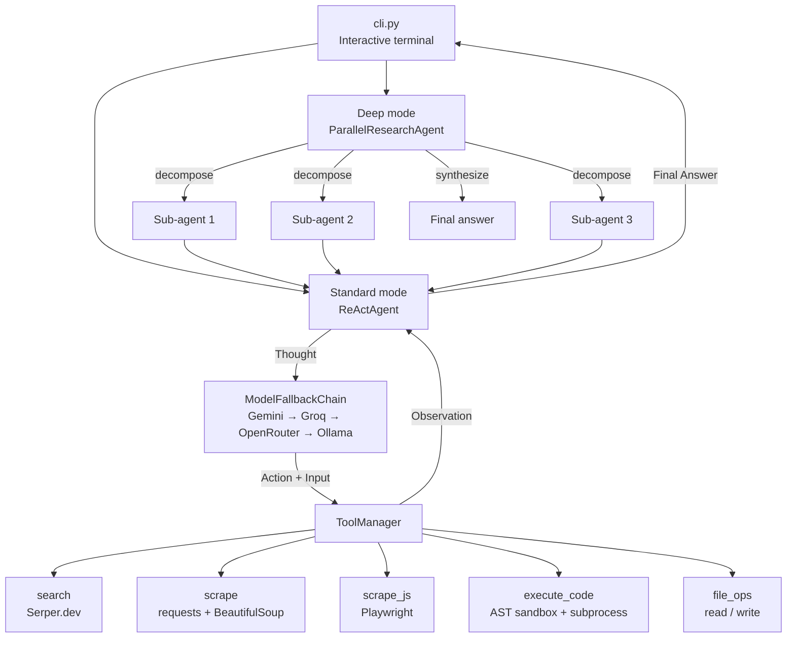

# web-research-agent

[](https://github.com/ashioyajotham/web_research_agent/actions/workflows/ci.yml)
[](https://pypi.org/project/web-research-agent/)
[](https://pypi.org/project/web-research-agent/)

## Motivation

Large language models have strong reasoning abilities but cannot act on the world — they cannot search the web, run code, or retrieve documents. Tool-augmented agents close this gap by interleaving reasoning steps with external actions.

This project implements the **ReAct** (Reasoning + Acting) loop proposed by Yao et al. (2022) as a practical, self-contained research assistant. The agent iterates between generating a *thought* about what it needs to do, selecting a *tool* to execute, and incorporating the resulting *observation* back into its context — repeating until it can produce a grounded final answer.

The central design questions this codebase explores are:

- How much of a research workflow can be automated by giving an LLM a small, well-defined tool set?
- Where do the failure modes lie — context overflow, prompt injection from hostile pages, repetitive tool calls, paywalled sources — and how should each be handled explicitly rather than silently?
- Can a parallel fan-out over decomposed sub-questions improve answer quality on multi-faceted tasks?

## Prior Work

| Work | Relevance |
|------|-----------|
| Yao et al., *ReAct: Synergizing Reasoning and Acting in Language Models*, ICLR 2023 ([arxiv](https://arxiv.org/abs/2210.03629)) | Core loop architecture |
| Schick et al., *Toolformer: Language Models Can Teach Themselves to Use Tools*, NeurIPS 2023 ([arxiv](https://arxiv.org/abs/2302.04761)) | Tool-use motivation |
| Nakano et al., *WebGPT: Browser-assisted question-answering with human feedback*, 2021 ([arxiv](https://arxiv.org/abs/2112.09332)) | Web retrieval for QA |
| Gao et al., *PAL: Program-aided Language Models*, ICML 2023 ([arxiv](https://arxiv.org/abs/2211.10435)) | Code execution as a reasoning tool |
| Mialon et al., *Augmented Language Models: a Survey*, 2023 ([arxiv](https://arxiv.org/abs/2302.07842)) | Survey of retrieval and tool-augmented LMs |

## Architecture

The system has two agent modes built on the same tool layer:


```mermaid
flowchart TD
    CLI["cli.py\nInteractive terminal"] --> SM["Standard mode\nReActAgent"]
    CLI --> DM["Deep mode\nParallelResearchAgent"]

    DM -->|decompose| SQ1["Sub-agent 1"]
    DM -->|decompose| SQ2["Sub-agent 2"]
    DM -->|decompose| SQ3["Sub-agent 3"]
    DM -->|synthesize| ANS["Final answer"]

    SQ1 & SQ2 & SQ3 --> SM

    SM -->|Thought| LLM["ModelFallbackChain\nGemini → Groq → OpenRouter → Ollama"]
    LLM -->|Action + Input| TM["ToolManager"]

    TM --> S["search\nSerper.dev"]
    TM --> SC["scrape\nrequests + BeautifulSoup"]
    TM --> BR["scrape_js\nPlaywright"]
    TM --> CE["execute_code\nAST sandbox + subprocess"]
    TM --> FO["file_ops\nread / write"]

    TM -->|Observation| SM
    SM -->|Final Answer| CLI
```

### Project structure

```
web_research_agent/
├── cli.py                      # Terminal UI: rich.Live streaming, session memory, history
├── webresearch/
│   ├── agent.py                # ReActAgent: Thought-Action-Observation loop, sliding-window prompt
│   ├── parallel.py             # ParallelResearchAgent: LLM decomposition + ThreadPoolExecutor fan-out
│   ├── memory.py               # ConversationMemory: fixed-capacity FIFO of (query, answer) pairs
│   ├── llm.py                  # LLMInterface: Gemini API, retry with API-specified backoff
│   ├── llm_compat.py           # OpenAICompatibleLLMInterface: Groq / OpenRouter / DeepSeek / Ollama
│   ├── llm_chain.py            # ModelFallbackChain: ordered provider list with quota-triggered switching
│   ├── credentials.py          # Secure credential storage: system keyring with env-var fallback
│   ├── config.py               # Config: credential resolution, validation, agent settings
│   └── tools/
│       ├── base.py             # Abstract Tool (name, description, execute)
│       ├── search.py           # SearchTool: Serper.dev, monthly usage tracking
│       ├── scrape.py           # ScrapeTool: HTML extraction, prompt-injection sanitization
│       ├── browser.py          # BrowserScrapeTool: Playwright fallback for JS-rendered pages
│       ├── code_executor.py    # CodeExecutorTool: AST pre-check, isolated TemporaryDirectory
│       └── file_ops.py         # FileOpsTool: read / write local files
└── tests/
    ├── test_agent_parsing.py   # Response parsing, prompt construction
    ├── test_memory.py          # ConversationMemory invariants
    ├── test_parallel.py        # Decomposition, fan-out, callbacks
    ├── test_sandbox.py         # Allowed and blocked code patterns
    ├── test_scraper.py         # Injection pattern filtering
    └── test_search_usage.py    # Monthly usage tracking
```

## Design decisions

**Prompt sliding window.** The ReAct loop appends every (thought, action, observation) triple to the prompt. At 5,000 chars per observation and 15 iterations, this approaches 75K tokens. The implementation keeps the last 8 steps in full and summarises earlier steps to one-line entries, trading recall depth for context budget.

**Observation sanitization.** Scraped web content can contain adversarial text designed to override agent instructions (`ignore all previous instructions`, `Final Answer: ...`). Observations are filtered through a regex pass before they enter the prompt. This is defence-in-depth alongside standard care when designing the prompt format.

**Action deduplication.** The agent occasionally calls the same tool with identical inputs in consecutive iterations. A per-run cache keyed on `(tool_name, sorted_json_input)` returns cached observations without consuming API quota.

**Parallel decomposition.** For multi-faceted questions the LLM is asked to decompose the task into up to 4 sub-questions, which are researched concurrently via `ThreadPoolExecutor`. Results are synthesised by a second LLM call. Decomposition failure falls back to treating the full question as a single query.

**Code sandbox.** The agent can generate and execute Python code. An AST walk checks for blocked module imports (`subprocess`, `socket`, `ctypes`, etc.) and dangerous `os.*` attribute access before the code reaches the interpreter. The subprocess runs in a `TemporaryDirectory` with API keys stripped from the environment.

**Rate-limit-aware retry.** Gemini 429 responses include a `retry_delay { seconds: N }` field. The LLM interface parses this and waits the specified duration rather than using a fixed exponential backoff that would exhaust retries before the window expires.

**Model fallback chain.** Gemini free-tier quotas (5–20 RPM, 20 req/day for 2.5 Flash) can be reached on long research sessions. Rather than halting, the agent falls back through an ordered chain of providers: Gemini 2.5 Flash → Groq (llama-3.3-70b) → OpenRouter (llama-3.3-70b:free) → Ollama (local). The switch is triggered on any 429 / quota error and announced in the terminal. Each fallback provider is activated only if its credential is configured; the chain degrades gracefully to a single provider if no fallbacks are set.

**Secure credential storage.** API keys are stored in the OS system keyring (Windows Credential Manager, macOS Keychain, Linux libsecret) via the `keyring` library. This prevents plain-text secrets in `~/.webresearch/config.env` on systems where the keyring is available. The fallback to a plain-text file is retained for headless servers and CI environments where no keyring backend is present.

## Installation

```bash
pip install web-research-agent
```

Optional — Playwright for JS-rendered pages:

```bash
pip install "web-research-agent[browser]"
playwright install chromium
```

Optional — additional LLM providers (Groq, OpenRouter, DeepSeek, Ollama):

```bash
pip install "web-research-agent[providers]"
```

### First-run setup

On the first launch `webresearch` starts an interactive setup that asks for each credential in turn:

```
1. Gemini API Key        (required)   → aistudio.google.com/app/apikey
2. Serper API Key        (required)   → serper.dev  (2,500 searches/month free)
3. Groq API Key          (optional)   → console.groq.com  (free tier)
4. OpenRouter API Key    (optional)   → openrouter.ai  (free models)
5. Ollama Base URL       (optional)   → http://localhost:11434/v1
```

Gemini and Serper cannot be skipped; the agent cannot function without them. The three optional keys activate the fallback LLM chain — without them, a Gemini rate limit will halt the current query.

Credentials are stored in the **OS system keyring** when available (Windows Credential Manager, macOS Keychain, Linux libsecret). On headless systems without a keyring backend they fall back to `~/.webresearch/config.env`. Only credentials are persisted; all other settings are read from package defaults at runtime.

To reconfigure at any time, choose option **5 — Reconfigure API keys** from the main menu.

### API key sources

| Credential | Required | Source |
|------------|----------|--------|
| `GEMINI_API_KEY` | Yes | [Google AI Studio](https://aistudio.google.com/app/apikey) |
| `SERPER_API_KEY` | Yes | [serper.dev](https://serper.dev) — 2,500 searches/month free |
| `GROQ_API_KEY` | No | [console.groq.com](https://console.groq.com) — free tier |
| `OPENROUTER_API_KEY` | No | [openrouter.ai](https://openrouter.ai) — free models available |
| `OLLAMA_BASE_URL` | No | Local Ollama instance, e.g. `http://localhost:11434/v1` |

Keys may also be placed in a `.env` file in the working directory, which takes precedence over both the keyring and the persistent config file (useful for per-project overrides).

### Windows PATH

If `webresearch` is not found after install:

```powershell
[Environment]::SetEnvironmentVariable(
    "Path",
    [Environment]::GetEnvironmentVariable("Path", "User") + ";$env:APPDATA\Python\Python313\Scripts",
    "User"
)
```

Or run as `python -m cli`.

## Usage

```bash
webresearch
```

**Standard mode** — sequential ReAct loop, up to 15 iterations.

**Deep Research mode** — LLM decomposes the question into sub-queries, each researched by a parallel agent, results synthesised into one answer.

### Batch processing

```bash
webresearch  # option 2, enter path to tasks file
```

Tasks file: one task per blank-line-delimited block.

```
By what percentage did Volkswagen reduce their Scope 1 and Scope 2
greenhouse gas emissions in 2023 compared to 2021?

Who is the current chair of the Basel Committee on Banking Supervision?
```

### Programmatic API

```python
from webresearch import ReActAgent, ParallelResearchAgent
from webresearch.config import Config
from webresearch.llm import LLMInterface
from webresearch.tools import ToolManager, SearchTool, ScrapeTool, CodeExecutorTool, FileOpsTool

cfg = Config()
cfg.validate()
llm = LLMInterface(api_key=cfg.gemini_api_key, model_name=cfg.model_name)

tools = ToolManager()
tools.register_tool(SearchTool(cfg.serper_api_key))
tools.register_tool(ScrapeTool())
tools.register_tool(CodeExecutorTool())
tools.register_tool(FileOpsTool())

agent = ReActAgent(llm=llm, tool_manager=tools)

def on_step(iteration: int, step):
    print(f"[{iteration}] {step.action}: {step.thought[:60]}")

answer = agent.run("What is the current Fed funds rate?", step_callback=on_step)
```

### Adding a tool

```python
from webresearch.tools.base import Tool

class MyTool(Tool):
    @property
    def name(self) -> str:
        return "my_tool"

    @property
    def description(self) -> str:
        return """One-line summary.

Parameters:
- param (str, required): description

Use this tool when you need to..."""

    def execute(self, param: str) -> str:
        return f"result for {param}"

tools.register_tool(MyTool())
```

## Configuration

All settings default to sensible values. Only `GEMINI_API_KEY` and `SERPER_API_KEY` must be provided. Settings may be placed in a `.env` file in the working directory (takes precedence over keyring and config file) or passed as environment variables.

**Credentials** (stored in keyring / config file, or passed via env var / `.env`):

| Variable | Required | Description |
|----------|----------|-------------|
| `GEMINI_API_KEY` | Yes | Primary LLM — Gemini 2.5 Flash |
| `SERPER_API_KEY` | Yes | Web search — Serper.dev |
| `GROQ_API_KEY` | No | First fallback LLM — Groq (llama-3.3-70b-versatile) |
| `OPENROUTER_API_KEY` | No | Second fallback LLM — OpenRouter (llama-3.3-70b:free) |
| `OLLAMA_BASE_URL` | No | Third fallback LLM — local Ollama instance |

**Agent settings** (env var or `.env` only; never persisted so they stay current across upgrades):

| Variable | Default | Description |
|----------|---------|-------------|
| `MODEL_NAME` | `gemini-2.5-flash` | Gemini model identifier |
| `MAX_ITERATIONS` | `15` | ReAct loop cap per query |
| `TEMPERATURE` | `0.1` | Sampling temperature |
| `MAX_TOOL_OUTPUT_LENGTH` | `5000` | Characters of tool output fed back to the LLM |
| `WEB_REQUEST_TIMEOUT` | `30` | HTTP timeout in seconds |
| `CODE_EXECUTION_TIMEOUT` | `60` | Subprocess timeout in seconds |

## Known limitations

- Paywalled and login-gated pages are not accessible. The scraper returns a skip message so the agent seeks alternative sources.
- PDF content is not parsed; the URL is noted in the observation.
- The Serper free tier allows 2,500 searches per month. Complex queries can consume 5-10 calls each.
- Parallel mode issues concurrent Gemini requests; free-tier rate limits (5 RPM for Gemini 2.5 Flash) are easily reached on multi-faceted queries. Configure Groq and/or OpenRouter API keys to activate the fallback chain, or enable billing on Google AI Studio for higher quota.

## Development

```bash
git clone https://github.com/ashioyajotham/web_research_agent.git
cd web_research_agent
pip install -e ".[dev]"
pytest tests/ -v   # 56 tests, no API keys required
```

CI runs the test suite on Python 3.9, 3.10, 3.11, and 3.12 for every push and pull request.

## References

- Yao, S., Zhao, J., Yu, D., Du, N., Shafran, I., Narasimhan, K., & Cao, Y. (2022). *ReAct: Synergizing Reasoning and Acting in Language Models*. ICLR 2023. https://arxiv.org/abs/2210.03629
- Schick, T., Dwivedi-Yu, J., Dessi, R., Raileanu, R., Lomeli, M., Zettlemoyer, L., Cancedda, N., & Scialom, T. (2023). *Toolformer: Language Models Can Teach Themselves to Use Tools*. NeurIPS 2023. https://arxiv.org/abs/2302.04761
- Nakano, R., Hilton, J., Balwit, A., Wu, J., Ouyang, L., Kim, C., Hesse, C., Jain, S., Kosaraju, V., Saunders, W., Jiang, X., Krueger, G., Uberoi, K., & Christiano, P. (2021). *WebGPT: Browser-assisted question-answering with human feedback*. https://arxiv.org/abs/2112.09332
- Gao, L., Madaan, A., Zhou, S., Alon, U., Liu, P., Yang, Y., Callan, J., & Neubig, G. (2023). *PAL: Program-aided Language Models*. ICML 2023. https://arxiv.org/abs/2211.10435
- Mialon, G., Dessi, R., Lomeli, M., Nalmpantis, C., Pasunuru, R., Raileanu, R., Roziere, B., Schick, T., Dwivedi-Yu, J., Celikyilmaz, A., Grave, E., LeCun, Y., & Scialom, T. (2023). *Augmented Language Models: a Survey*. https://arxiv.org/abs/2302.07842

## License

MIT
